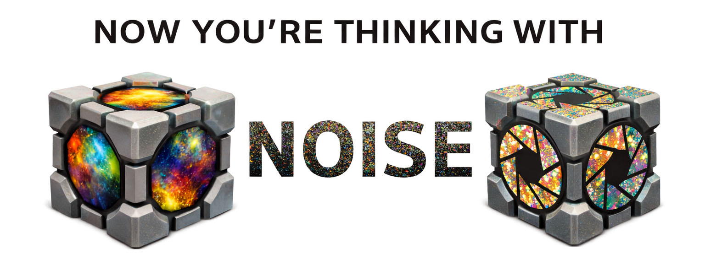
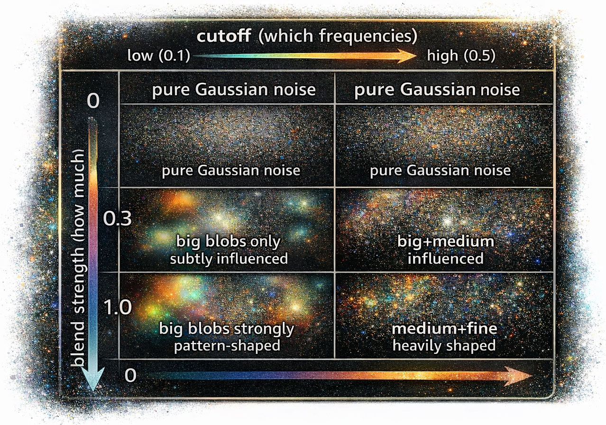

# Spectral Blending

**Feature**: Inject noise pattern spatial structure into latent noise for composition control

<p align="center">
  <a href="https://www.youtube.com/watch?v=BePtsISQQpk&t=135s">
    
  </a>
</p>

## Overview

Spectral blending lets you influence the spatial composition of generated images by blending the low-frequency structure of a noise pattern (Plasma, Gaussian, etc.) into the latent noise that the diffusion model uses for generation. The result: your noise pattern's spatial layout subtly guides where objects, colors, and features appear in the generated image — while maintaining full prompt adherence.

This works by operating in the frequency domain (FFT), replacing low-frequency components of standard Gaussian noise with normalized components from your chosen noise pattern. A power-preserving quadrature blend ensures the noise maintains the N(0,1) statistics that diffusion models require.

## How to Use

1. Set `fill_type` to a noise pattern (e.g., DazNoise: Plasma)
2. Connect a **VAE** to the node
3. Set `blend_strength` to a value > 0 (start with 0.1)
4. Connect the **latent** output to your sampler
5. Set the sampler's seed to **-2** (if using patched ClownsharKSampler)

The `fill_type` controls the visual pattern (visible in the IMAGE output). The `blend_strength` controls how much that pattern's spatial structure influences the latent noise.

## Blend Strength Guide

The maximum usable `blend_strength` varies by noise type. Higher values inject more spatial structure but may reduce prompt adherence. The threshold depends on how much low-frequency energy the noise pattern contains.

### Empirical Thresholds (Qwen model, denoise=1.0, 19 steps)

| fill_type | Recommended | Max coherent | Notes |
|-----------|-------------|-------------|-------|
| DazNoise: Plasma | 0.10 - 0.15 | ~0.17 | Very strong low-frequency blobs. Only noise type that breaks coherence at moderate values. Most aesthetically distinctive at low blend. |
| DazNoise: Gaussian | 0.20 - 0.50 | 1.0 | Per-pixel noise, very close to standard Gaussian. Works at full blend. |
| DazNoise: Pink | 0.20 - 0.50 | 1.0 | Per-pixel noise with brightness bias. Works at full blend. |
| DazNoise: Brown | 0.20 - 0.50 | 1.0 | Per-pixel noise with extreme brightness bias. Produces more defined edges at high blend. Works at full blend. |
| DazNoise: Greyscale | 0.20 - 0.50 | 1.0 | Monochrome per-pixel noise. Works at full blend. |
| noise (built-in) | 0.20 - 0.50 | ~1.0 | Gaussian, std=0.1. Expected to match DazNoise: Gaussian behavior. |
| random (built-in) | 0.20 - 0.50 | ~1.0 | Uniform random per-pixel. Expected to work at full blend. |

**Key finding**: All per-pixel noise types (everything except Plasma) work at `blend_strength=1.0`. The coherence threshold is determined by **spatial correlation scale**, not noise distribution. Plasma has large coherent blobs (high spatial autocorrelation) that overwhelm the model; per-pixel noise types have minimal spatial correlation and are safe at any blend value.

**Note**: These thresholds were measured with Qwen Image model and may vary with other models (SD1.5, SDXL, FLUX, etc.). Models with stronger text conditioning may tolerate higher blend values.

### What Happens at Different Strengths

| blend_strength | Effect |
|---------------|--------|
| 0.0 | Pure Gaussian noise. No pattern influence. Identical to standard generation. |
| 0.05 - 0.10 | Very subtle. Slight spatial bias barely visible in output. Good for gentle composition nudging. |
| 0.10 - 0.15 | Moderate. Visible spatial influence on where objects/colors appear. Recommended starting point for Plasma. |
| 0.15 - 0.20 | Strong for Plasma, moderate for Gaussian. Composition clearly influenced by pattern layout. |
| 0.20 - 0.40 | Works well with Gaussian/flatter noise types. Plasma becomes abstract at these values. |
| 0.40 - 0.70 | Only works with noise types close to Gaussian distribution. Strong compositional control. |
| 0.70+ | Most noise types produce abstract output. Only very flat-spectrum noise remains coherent. |

### The Coherence Boundary

At the exact threshold (e.g., 0.17 for Plasma), something interesting happens: the model takes the dominant concept from the CLIP prompt and renders it coherently but with the **styling** of the noise pattern. This is effectively a novel form of **style transfer via initial noise** — the noise pattern's spatial structure becomes an aesthetic influence rather than a compositional one.

## Why Plasma Is Different

The coherence threshold is determined by **spatial correlation scale** — how large the coherent structures in the noise pattern are.

- **Per-pixel noise types** (Gaussian, Pink, Brown, Greyscale): Each pixel is independently generated. Even though Pink/Brown have frequency-biased distributions, their spatial autocorrelation is minimal — neighboring pixels are not strongly correlated. The diffusion model can denoise from these at any blend strength because the noise doesn't impose large-scale spatial structure.

- **Plasma**: Generated via diamond-square recursive subdivision, producing large coherent blobs where neighboring pixels are highly correlated across tens or hundreds of pixels. When this spatial structure is injected into latent noise (even after normalization), it creates strong low-frequency bias that overrides the model's ability to impose prompt-driven composition.

The spectral blending function normalizes the total power to match Gaussian noise, but it preserves the **spatial correlation structure** of the pattern. For per-pixel noise, this structure is minimal. For Plasma, it's dominant.

**Practical implication**: When using Plasma, keep blend_strength below ~0.17. For all other noise types, blend_strength=1.0 is safe. The visual differences between noise types at high blend create subtle aesthetic variations — Brown produces more defined edges, Pink has a brighter feel, Greyscale is more neutral.

## Workflow Patterns

### Diversity from a Single Seed

Keep the same `fill_seed` value but change `fill_type`:
- Same seed preserves facial structure and character identity
- Different noise types produce different compositions and styles
- This is a powerful tool for exploring visual variations without losing the "character" defined by the seed

### Style Exploration at the Boundary

Set `blend_strength` to the coherence boundary for your noise type:
- The output maintains the CLIP prompt's subject/concept
- But the spatial composition and visual style shift based on the noise pattern
- Plasma at 0.17-0.18 produces particularly striking stylized output

### Composition Control

Use noise patterns with specific spatial structure:
- Plasma blobs bias where large features appear
- Vertical/horizontal noise patterns could bias portrait vs landscape composition
- Asymmetric patterns bias object placement (future noise types could exploit this)

## Image-to-Noise Spectral Fusion (v0.10+)

With the [`image_purpose`](image-purpose.md) widget, spectral blending extends beyond fill_type noise patterns. Two image_purpose modes use spectral blending with the INPUT image as the pattern source:

- **img2noise**: The input image's spatial structure shapes the noise. The image's composition (where large features, colors, and brightness regions are) biases where the model places objects in the generated image. See the [Image Purpose Guide](image-purpose.md#img2noise) for details.

- **img2img + img2noise**: Layered mode. VAE-encodes the image for standard img2img AND generates image-shaped noise. The corruption noise reinforces the image's own spatial structure instead of fighting it.

When using an image as the pattern source, `blend_strength` defaults to 0.15 if not explicitly set. Real images have much stronger low-frequency content than noise patterns, so lower values are needed:

| Pattern Source | Recommended blend_strength | Notes |
|---------------|---------------------------|-------|
| DazNoise: Plasma | 0.10 - 0.15 | Strong low-frequency blobs |
| DazNoise: Gaussian/Pink/Brown | 0.20 - 0.50 | Per-pixel, safe at high values |
| Photo (img2noise) | 0.05 - 0.15 | Very strong low-frequency content |
| Sketch (img2noise) | 0.10 - 0.25 | Less low-frequency energy |

## Technical Details

### The Two Controls

Spectral blending has two parameters that control different aspects of the blend:

**`blend_strength`** (user-facing, 0.0-1.0) controls **how much** pattern influence is mixed in. At 0.0, the output is pure Gaussian noise. At 1.0, the maximum amount of pattern structure is injected across all affected frequencies.

**`cutoff`** (currently hardcoded at 0.2) controls **which frequencies** are affected. It's a fraction of the Nyquist frequency that defines the boundary between "pattern frequencies" and "Gaussian frequencies." Frequencies below the cutoff get blended; frequencies above stay as pure Gaussian noise.

These two parameters interact:

<p align="center">
  
</p>

Raising `cutoff` while keeping `blend_strength` the same increases total pattern influence because more frequency bands are being blended. A `blend_strength=0.15` that's coherent at `cutoff=0.2` might produce abstract output at `cutoff=0.5`.

**Why cutoff is hardcoded at 0.2**: At this value, only blob-scale spatial structure (~5 latent pixels, ~40 pixel-space pixels) is transferred from the pattern. Fine detail (edges, textures) stays as pure Gaussian noise. This is a good default because:
- It captures the composition-scale features users want to transfer
- It leaves enough frequency range as pure Gaussian for the model to work with
- The empirical thresholds above were measured at this cutoff

A future version may expose cutoff as a parameter for advanced users who want finer control over which spatial scales get blended.

### The Blending Algorithm

The algorithm operates in the frequency domain (FFT) to separately control how much pattern structure is injected at each spatial frequency:

1. Generate pure Gaussian noise (`torch.randn`) in latent space, seeded by `fill_seed`
2. Generate the pattern source:
   - **Standard mode**: the fill_type noise pattern in pixel space
   - **img2noise mode**: the input image, transformed per `output_image_mode`
3. Resize the pattern to latent spatial dimensions via bilinear interpolation
4. Tile RGB channels to match latent channel count (e.g., 3 RGB -> 16 latent channels for Qwen)
5. Normalize pattern to zero-mean
6. FFT both tensors (2D real FFT on spatial dimensions)
7. Normalize pattern FFT to match Gaussian expected power (global RMS scaling)
8. Build radial Gaussian rolloff frequency mask centered at DC, width controlled by `cutoff`
9. Power-preserving quadrature blend at each frequency bin (see below)
10. Interpolate between pure Gaussian FFT and blended FFT by `blend_strength`
11. IFFT back to spatial domain
12. Per-channel normalization to unit standard deviation (safety correction)

### The Frequency Mask

The mask is a 2D Gaussian centered at DC (zero frequency) in the frequency domain:

```
W(f) = exp(-0.5 * (|f| / cutoff)^2)
```

where `|f|` is the radial distance from DC normalized so that 1.0 = Nyquist frequency.

At `cutoff=0.2`:
- DC (f=0): W = 1.0 (full pattern influence)
- f=0.1 Nyquist: W = 0.88 (strong pattern influence)
- f=0.2 Nyquist: W = 0.61 (moderate pattern influence)
- f=0.4 Nyquist: W = 0.14 (weak pattern influence)
- f=0.6+ Nyquist: W < 0.01 (pure Gaussian)

The Gaussian rolloff is preferred over a sharp cutoff because it avoids Gibbs ringing artifacts (oscillations at the transition boundary).

### Why Quadrature Blend?

At each frequency bin, the pattern and Gaussian components are blended with quadrature weights:

```
F_blended(f) = sin(W(f) * pi/2) * F_pattern(f) + cos(W(f) * pi/2) * F_gaussian(f)
```

A naive linear blend `W*P + (1-W)*G` would drop the variance at intermediate W values because `W^2 + (1-W)^2 < 1` for W in (0, 1). The quadrature blend guarantees `sin^2 + cos^2 = 1`, preserving total power at every frequency bin. This is critical because diffusion models are sensitive to noise variance — incorrect power levels cause the model to over- or under-denoise.

### The Alpha Interpolation

After the quadrature blend produces a fully-blended result, the `blend_strength` parameter (alpha) interpolates between pure Gaussian and the blended result:

```
F_output = (1 - alpha) * F_gaussian + alpha * F_quadrature_blended
```

This gives `blend_strength=0` a pure Gaussian identity (no pattern influence), and `blend_strength=1` the maximum pattern influence as determined by the cutoff mask.

### Post-Blend Normalization

The final spatial-domain result is normalized per-channel to unit standard deviation. This is the "universal rule" from the noise shaping literature: always renormalize after any spectral manipulation to ensure the noise maintains N(0,1) statistics that diffusion models expect.

### Research Background

The spectral blending approach draws from several academic findings:
- **InitNo** (Guo et al. 2023): Early-step attention patterns in diffusion models are determined by the structure of the initial noise x_T
- **FreeNoise** (Mo et al. 2023): Structured noise is compatible with diffusion without retraining
- **SDEdit**: Intermediate injection is guaranteed on-manifold but limits prompt freedom
- Community consensus: spectral manipulation at x_T provides the best balance of structural influence vs prompt adherence

### Sampler Requirements

The blended noise is output via the **latent** pin with a `use_as_noise: True` flag. Standard ComfyUI samplers ignore this flag. To use the noise:

- **ClownsharKSampler (RES4LYF)**: Set seed to **-2**. Requires patched `beta/samplers.py` (included in `docs/code/`).
- **Standard KSampler**: Not supported. The sampler generates its own noise from seed.

See [extended-fill-types.md](extended-fill-types.md#sampler-integration-experimental) for patching instructions.

## Related Documentation

- **[Image Purpose Guide](image-purpose.md)** — `img2noise` and `img2img + img2noise` modes use spectral blending with the input image as pattern source
- **[Extended Fill Types](extended-fill-types.md)** — DazNoise fill patterns, seed control, and sampler integration

## Version History

- **v0.10.0**: Image-to-noise spectral fusion via `image_purpose` widget; `output_image_mode` controls image transform before noise shaping
- **v0.8.4**: Fixed seed serialization — actual seed saved in workflow JSON for reproducibility
- **v0.8.2**: Added spectral blending with `blend_strength` parameter
- **v0.8.1**: Raw `torch.randn()` latent noise (no pattern influence)
- **v0.8.0**: Seed widget, 5D VAE support, noise-to-latent pipeline
- **v0.7.0**: DazNoise extended fill types
